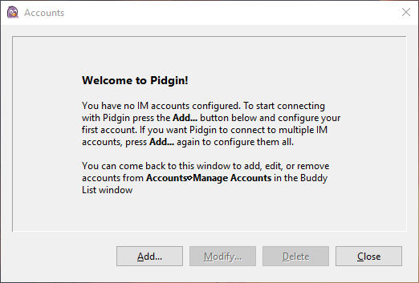
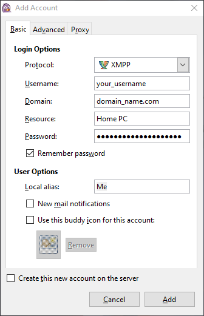

# Pidgin

- [Pidgin](#pidgin)
  - [Tasks](#tasks)
    - [Download and Install](#download-and-install)
      - [Windows](#windows)
      - [Linux](#linux)
      - [FreeBSD](#freebsd)
      - [macOS](#macos)
    - [Register an account](#register-an-account)
    - [Log into an existing account](#log-into-an-existing-account)
    - [How to add a new contact](#how-to-add-a-new-contact)
    - [Start a chat with a contact](#start-a-chat-with-a-contact)
    - [Share a picture, video or voice message](#share-a-picture-video-or-voice-message)
    - [Share your current location with a contact](#share-your-current-location-with-a-contact)
    - [Create a group chat](#create-a-group-chat)
    - [Find public community chats](#find-public-community-chats)

[Pidgin](https://pidgin.im/) is a chat program which lets you log into accounts on multiple chat networks simultaneously. This means that you can be chatting with friends on XMPP and sitting in an IRC channel at the same time.

Pidgin runs on Windows, Linux, and other UNIX-like operating systems.

Pidgin is compatible with the following chat networks out of the box: Jabber/XMPP, Bonjour, Gadu-Gadu, IRC, Novell GroupWise Messenger, Lotus Sametime, SILC, SIMPLE, and Zephyr. It can support many more with [plugins](https://pidgin.im/plugins).

## Tasks

The following sections contain descriptions of how to perform some basic tasks with Pidgin.

### Download and Install

Pidgin offers installation instructions for Windows, Linux (Debian/Ubuntu), FreeBSD and macOS on the official website.

Head to [pidgin.im](https://pidgin.im/install/) to find out how to install the latest version of Pidgin for your operating system.

#### Windows

For Windows, there's an executable installer that you can download from the [pidgin.im](https://pidgin.im/install/) website, as well as a portable version that doesn't need installation. Head over to the their install section for more information.

#### Linux

For Linux, you can usually find Pidgin within your Linux distribution's official package repositories and you can use your package manager to install it.

For Debian/Ubuntu:

```sh
sudo apt update
sudo apt install pidgin
```

#### FreeBSD

For FreeBSD, there's an official package available which you can install with the `pkg` command.

```sh
pkg install pidgin
```

#### macOS

For macOS, the Pidgin developers recommend [Adium](https://adium.im/) for a more native experience, which is a similar IM client that uses `libpurple` (the core of Pidgin).

If you still want to install Pidgin on macOS, you may find the package provided through third-party macOS package managers, like [Homebrew](https://brew.sh/).

To install with Homebrew:

```sh
brew install pidgin
```

### Register an account

When you first install Pidgin and start it, you are usually greeted with the `Accounts` window:



If you've accidentally closed the `Accounts` window, open Pidgin's main window (check the tray if Pidgin is minimized and not showing on the task bar) and click the 'Accounts &rarr; Manage Accounts' menu item or press <kbd>Ctrl</kbd> + <kbd>A</kbd> on Windows.

From the `Accounts` window click `Add` and the `Add Account` window opens:



Complete the main form on the `Basic` tab:

1. Protocol: select XMPP
2. Username: enter your username (the part before the `@` sign from the complete user ID, for example `me` from the ID `me@somedomain.com`).
3. Domain: enter the domain name from your ID (the part after the `@` sign, for example `somedomain.com` from the ID `me@somedomain.com`)
4. Resource (optional): enter a name you would like to give to your current resource, such that multiple logins to the same XMPP account from different devices, can be distinguished if necessary.
5. Password: enter your account's password.
6. Local alias (optional): this custom alias appears in chat logs and can be used to specify a shorter name for how your messages appear in local chat logs, so this is only visible to you. For example `Me`, instead of `your_complete_username`.

### Log into an existing account

To be continued...

### How to add a new contact

To be continued...

### Start a chat with a contact

To be continued...

### Share a picture, video or voice message

To be continued...

### Share your current location with a contact

To be continued...

### Create a group chat

To be continued...

### Find public community chats

To be continued...
