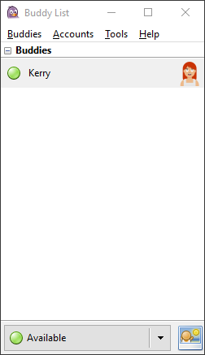
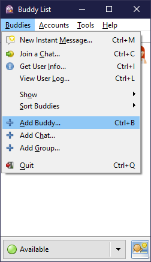
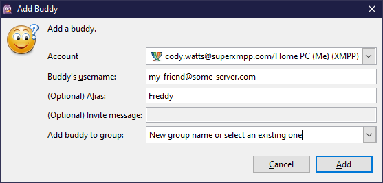
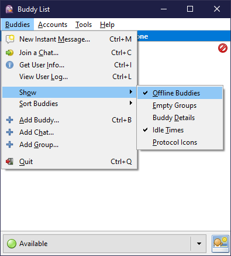
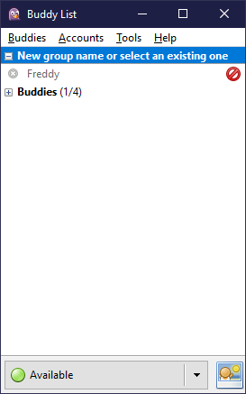
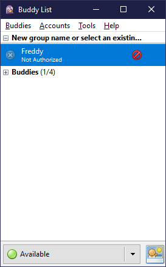
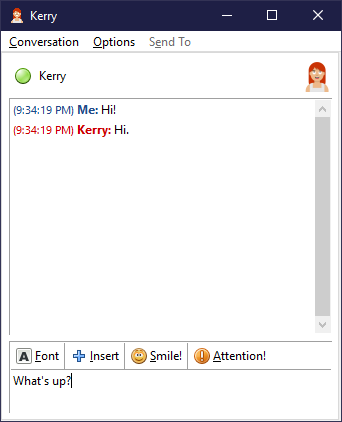
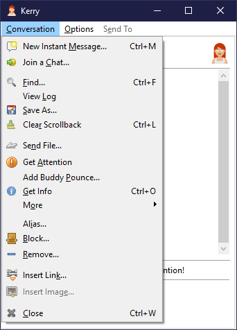
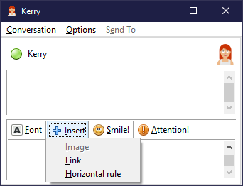

# Pidgin

- [Pidgin](#pidgin)
  - [Tasks](#tasks)
    - [Download and Install](#download-and-install)
      - [Windows](#windows)
      - [Linux](#linux)
      - [FreeBSD](#freebsd)
      - [macOS](#macos)
    - [Register an account](#register-an-account)
    - [Log into an existing account](#log-into-an-existing-account)
    - [How to add a new contact](#how-to-add-a-new-contact)
    - [Start a chat with a contact](#start-a-chat-with-a-contact)
    - [Share a picture, video or voice message](#share-a-picture-video-or-voice-message)
      - [Send a file](#send-a-file)
    - [Share your current location with a contact](#share-your-current-location-with-a-contact)
    - [Create a group chat](#create-a-group-chat)
    - [Find public community chats](#find-public-community-chats)

[Pidgin](https://pidgin.im/) is a chat program which lets you log into accounts on multiple chat networks simultaneously. This means that you can be chatting with friends on XMPP and sitting in an IRC channel at the same time.

Pidgin runs on Windows, Linux, and other UNIX-like operating systems.

Pidgin is compatible with the following chat networks out of the box: Jabber/XMPP, Bonjour, Gadu-Gadu, IRC, Novell GroupWise Messenger, Lotus Sametime, SILC, SIMPLE, and Zephyr. It can support many more with [plugins](https://pidgin.im/plugins).

## Tasks

The following sections contain descriptions of how to perform some basic tasks with Pidgin.

### Download and Install

Pidgin offers installation instructions for Windows, Linux (Debian/Ubuntu), FreeBSD and macOS on the official website.

Head to [pidgin.im](https://pidgin.im/install/) to find out how to install the latest version of Pidgin for your operating system.

#### Windows

For Windows, there's an executable installer that you can download from the [pidgin.im](https://pidgin.im/install/) website, as well as a portable version that doesn't need installation. Head over to the their install section for more information.

#### Linux

For Linux, you can usually find Pidgin within your Linux distribution's official package repositories and you can use your package manager to install it.

For Debian/Ubuntu:

```sh
sudo apt update
sudo apt install pidgin
```

#### FreeBSD

For FreeBSD, there's an official package available which you can install with the `pkg` command.

```sh
pkg install pidgin
```

#### macOS

For macOS, the Pidgin developers recommend [Adium](https://adium.im/) for a more native experience, which is a similar IM client that uses `libpurple` (the core of Pidgin).

If you still want to install Pidgin on macOS, you may find the package provided through third-party macOS package managers, like [Homebrew](https://brew.sh/).

To install with Homebrew:

```sh
brew install pidgin
```

### Register an account

When you first install Pidgin and start it, you are usually greeted with the `Accounts` window:


If you've accidentally closed the `Accounts` window, open Pidgin's main window (check the tray if Pidgin is minimized and not showing on the task bar) and click the **Accounts &rarr; Manage Accounts** menu item or press <kbd>Ctrl</kbd> + <kbd>A</kbd> on Windows.

Registering new XMPP accounts is easy but it requires that you create the account with a server that allows open registrations.

From the `Accounts` window click `Add` and the `Add Account` window opens:


> ### IMPORTANT
>
> To register a new account, make sure you tick the `Create this new account on the server` check mark at the bottom of the `Basic` tab, otherwise Pidgin will only try to log in with the information you provide, which might result in an error if the account does not exist on the server.

Complete the `Login Options` form:

1. **Protocol** (required): select `XMPP` from the dropdown list.
2. **Username** (required): enter your desired username (the part before the `@` sign from the complete user ID, for example `me` from the ID `me@some-server.com`).
3. **Domain** (required): enter the domain name of the XMPP server you wish to register with (the part after the `@` sign, for example `some-server.com` from the ID `me@some-server.com`)
4. **Resource** (optional): enter a custom name you would like to give to your current `resource`, a simple string that uniquely identifies multiple logins to the same XMPP account, for example from different devices (`Home PC`, `iPhone`, etc).
5. **Password** (required): enter the password you would like to register your account with.
6. **Remember password** (optional): tick this check mark if you don't want to be asked for your password every time you restart Pidgin or log out and back in again.

Optionally, you can also complete the `User Options` form:

1. **Local alias** (optional): this custom alias appears in chat logs and can be used to specify a shorter name for how your messages appear in local chat logs, so this is only visible to you. For example `Me`, instead of `your_complete_username`.

<a name="create-this-new-account-on-the-server"></a>
Tick the `Create this new account on the server` check mark at the bottom if you haven't already done so.

Finally, click the `Add` button and Pidgin should automatically request the creation of your account with the server and then log you in.

If successful, you should see an empty buddy list and your status set to `Available`.



With some servers you can sometimes see a bot was added to your buddy list by default, usually to send you a welcome message or to provide help.
To find out more about adding contacts to your buddy list, head to the [How to add a new contact](#how-to-add-a-new-contact) section.

### Log into an existing account

Logging in to an existing account is similar to [registering a new account](#register-an-account). The difference is that you must have an existing account and you must not tick the [`Create this new account on the server`](#create-this-new-account-on-the-server) check mark.

### How to add a new contact

To add a new contact, click the **Buddies &rarr; Add Buddy...** menu item.



The `Add Buddy` window opens:



Complete the required fields:

- **Account**: if you're logged in to multiple accounts, select which one to add your contact to.
- **Buddy's username**: enter your contact's complete user ID. If they're using the same server as the currently selected account, you can omit the server name and enter just the user name (only the part on the left of the `@` sign).
- **Alias** (optional): enter an alias for your contact, if you prefer a shorter or more distinct name for your contact.
- **Add buddy to group**: select an existing group from the dropdown list or enter a new group name to create a new group for this contact.

Finally, click the `Add` button.
If your contact is online and has accepted to connect with you, you will see their status in Pidgin's Buddy List.
If you don't see your contact, then read on.

By default, Pidgin doesn't show empty groups and offline contacts, or contacts that haven't yet accepted for you to see their presence.
If you want to check if the contact has indeed been added to your contacts list, click and enable the **Buddies &rarr; Show &rarr; Offline Buddies** menu item.



You should now see your new contact even if they're offline or haven't answered your request to connect yet.



Optionally, click and enable the **Buddies &rarr; Show &rarr; Buddy Details** menu item to see if your contact hasn't authorized you yet or if they're just offline.



### Start a chat with a contact

To start a new chat with someone, locate the corresponding contact in Pidgin's Buddy List, double click it and a new conversation window will appear:



Notice the local alias we were talking about in the [Register an account](#register-an-account) section.
There, we set it to "Me". In the above screenshot you can see how that would appear in a chat.

Some useful tips:

- XMPP allows you to send messages to offline contacts as well as receive messages from offline contacts. Sometimes you might want to hide your online status and not just appear as `Away` or `Busy`. To open a chat to an offline contact, you need to show offline contacts first, by enabling the **Buddies &rarr; Show &rarr; Offline Buddies** menu item from the Buddies List window.
- If you have a very long contacts list, you can search a contact by name just by typing in the Buddy List window. You don't need to select anything. A search box will appear as soon as you start typing and the selection in the Buddy List will jump to the nearest match. If the selected contact matches your request, pressing `Enter` will open a new chat window for the selected contact and close the search. Press `Esc` to cancel the search at any time.

### Share a picture, video or voice message

> ### Quick info
>
> The capability to send media like pictures, video files and voice messages, depends on the XMPP server's provider.
>
> Providing services like hosting for image files, audio files or video files can be very expensive. Not all XMPP chat servers offer these services, especially some of the free ones.
>
> These limitations might seem like they are not working in XMPP's favor, but this is the main reason why other similar instant messaging services are free and XMPP might not be: other services make money by mining and selling your personal information (and in exchange you get free file transfers and sharing).
>
> If you take privacy seriously but you still want advanced media capabilities, you can look at paid XMPP services or you can run your own XMPP server (it's actually not that hard to find a host).

Pidgin does not have advanced video or voice chats functionality built in like some other IM clients. It can send files though.

#### Send a file

To send a file to a contact, any file (picture, video, audio, etc.), you can right-click a contact in your Buddy List and choose **Send File...**, or in a chat window open the **Conversation** menu and click **Send File...** from there:



Pidgin can also send inline images and links. Press the `Insert` button right above the message input box in a chat window:



Sending images this way depends on the server's capabilities, so the **Image** option might appear as disabled.

### Share your current location with a contact

To be continued...

### Create a group chat

To be continued...

### Find public community chats

To be continued...
